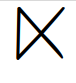
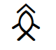
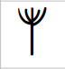

# Decipherment of Indus Valley Script

*M.V.Bhaskar and S.K.Venkatesan*

**BTW**:

1. M77 is [Mahadevan's numbering system](https://indusscript.in/)
2. DED is [Dravidian Entymology Dictionary](https://dsal.uchicago.edu/dictionaries/burrow/)

## Simple glyphs

|M77 No.|Glyph|Tamil|DED|Description|
|:---:|:---:|:---:|:---:|:---:|
|86||வடம்,வட-,-ட|5220|வடம்|
|87||இரு|474|இரு|
|89||முன்|5052|முன்|
|95||நால்,நல்|3655,3610|நால்,நல்|
|96||அய்|2826|அய்|
|108||ஆறு|2485|ஆறு|
|110||ஏழு|910|ஏழு|
|1||வன்,அன்,வள்,அள்,வர்,அர்||அவன்,அவள்,அவர்|
|328||உ,ஊ, வ|651,761|உரல்,உரி|
|373||ப,பா|3805,4016|பகல், பன், பள்ளம்|
|374||ண்,ன்,ந்|2640|(ப)-ண்|
|59||க,கண்,கயல்|1159|கண்|
|70||கண்ட|1159|கண்|
|70||கொண்ட,கோண்ட|2216|கோண்ட|
|124||உழவன்|688|உழவன்|
|53||த,தவ,தன்|3110|தவளை|
|216||த,தவ,தன்|3110|தவளை|
|287||அர|5159|அர|
|47||அரணை|204|அரணை|
|78||புர்,புரி|4374|காட|
|127||அலகு, அழகு|237|அலகு|
|319||முறி,முற|4977|முறி,முறுக்கு|
|134||பெரு|4411|பெரு|
|261||கோ|2207|கோட்டை|
|197||மேல்,மாடம்|5058|மேல்,மாடம்|
|402||முன்-நாடு|3638|நாடு|
|162||வேல்|5536|வேல்|
|181||வலை|5288|வலை|
|149||நல்வழி|3610,5297|நல்வழி|
|249||அச்சு,-ச்சு|47|அச்சு|
|155||அன்பு, அனுப்பு|329,330|அனுப்பு|
|83||இறக்கன்,இற|501|இறக்கம்|
|49||நல்-குல-|1829|குளம்பு|
|50||ஆட்-, ஆட்டு,ஆத்து|5153|ஆ,ஆடு, ஆட்டு|
|124||ஏர்|2815|ஏர்|
|125||விலகு,விட்டு|5423|விலகு|
|323||இல-|497|இலை|
|325||இலந்த|497|இலை|
|326||இலந்த-நல், நல்-இலந்த|497|இலை|
|327||முன்மூ-இருவழி-இல்லவன்|497|இலை|

## Clitics
|:---:|:---:|:---:|:---:|:---:|
|26" src="ivc-logos/M97.png" height="30px">|-ட,-டு,-த,-து|-|-|
|99||-ர,-ரு,-ற,-று|-|-|
|123||-யர், -யார்|-|-|

## Complex glyphs

|M77 No.|Glyph|Tamil|DED|Description|
|:---:|:---:|:---:|:---:|:---:|
352||ஊர், ஊரார்|752|ஊர், ஊரார்|
|267||கோட்/கோட்டை|||
|391||பாகன்|||
|293||(வல்-)அரண்|||
|299/287||*-அரண்|||
|296||வழி, அற-வழி|||
|43||நல்-அறண்|||
|8||வேலன், வள்ளி|||
|65||பெருங்கண்|||
|199||மேல்-வள்ளி, மாட-வள்ளி|||
|375||போடு, பட்டு, படு, பட்டி|||
|?||இரு(ண்)ட|||
|?||இருந்தை-நல்லம், நல்லிருந்தை|||
|?||வன்னிலைத்திரு|||
|?||அரண்-கண், அரங்கண்|||
|358||செவ்வூர்|||
|347||வேலூர்|||
|?||முன்-நல்வரண், நல்முரண்|||
|415||முப்பேடு|||
|298||(வல்-)அறந்தை|||
|119||மும்-முன்னோர், இரு-முன்னோனும், இரு-முன்னமும்||
|120||மும்முன்னோனும், மும்முன்னமும்|||
|121||நல்நல்லோனால்|||
|116||நல்லை|||
|112||நல்லம், நலம்|||
|?||நல்லிணை|||
|171||நில்வஞ்சி|||
|?||ஏழிணை|||
